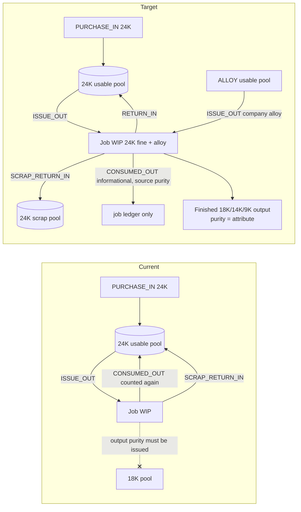
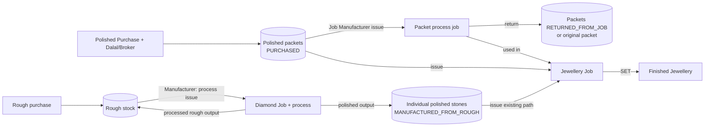

# ZYNORALUXE ERP — Phase 7 Improvement Plan

Companion to `PHASE_7_CURRENT_STATE_AUDIT.md`. Every design choice below
is traced to an audit finding (`A4.x` = audit table row). Additive upgrade
on top of `main` @ `b472901`; nothing in Phases 1–6 is rebuilt.

---

## 0. Decisions required before or during implementation

Items marked **BLOCKING** stop the dependent work; everything else has a
documented default that the Owner can override.

| ID | Decision | Default if not overridden | Blocks |
|---|---|---|---|
| **D1 — BLOCKING** | Which isolated PostgreSQL database may be used for migrations, seed, and real-browser E2E? The only configured one is production (A§2.3). | None — production must not be used | Step 7 migration apply, step 12 E2E, `rateLimit.test.ts` |
| **D2 — BLOCKING for the literal example** | 24K fineness: keep the seeded **99.900%** or change the master to **100.000%**? | Keep 99.900% on any existing DB; tests prove the locked example with a 100% fixture **and** with 99.9% | Seed value for new/empty DBs, E2E expectations |
| D3 | 14K fineness is 58.500% | 58.500% (existing master, unchanged) | — |
| D4 | Historical effect of A4.9/A4.10 on an existing database: report only, or Owner-approved correction voucher? | **Report only** — read-side fix, no rewrite of posted history; a read-only reconciliation script lists any divergence | — |
| D5 | Process output kind: `4P / Laser` → rough, `HPHT / Grow` → rough, `Polishing` → polished, `Rough Polish` → rough | As listed; editable per process by Owner | — |
| D6 | GST on brokerage and on process/job-work charges | Not posted (same as existing Karigar labour); recorded fields only | — |
| D7 | Party model for Dalal/Broker and Manufacturer | New `PartyType` values `BROKER` ("Dalal / Broker") and `MANUFACTURER`; Diamond jobs accept `KARIGAR` or `MANUFACTURER` | — |
| D8 | Can Staff create Polished Purchases? | Yes — same as existing Rough/Metal purchases (`requireUser`); cost never shown back to Staff | — |
| D9 | Packet return into the original packet vs always a new packet | Return goes back into the **original** packet only when every merge-key attribute is unchanged; otherwise a new child packet | — |
| D10 | Production rollout | Out of scope — no deploy, no production migration (instruction §15.16) | — |

---

## 1. Exact scope

Priority order (P0 must ship together; later tiers build on it):

**P0 — correctness and the locked metal flow**
1. Fix Metal Stock semantics: `CONSUMED_OUT` stops reducing the usable pool (A4.9); scrap is its own pool, never issuable (A4.10).
2. Cross-purity finished outputs: issue 24K, receive 18K/14K/9K (A4.12) without any movement against an unissued pool.
3. `9K Gold` purity at 37.500%, created only if missing.
4. Copper/Alloy as real metal stock (`MetalType.ALLOY`), explicit alloy source on receipt (Company stock / Karigar-added / Included).
5. Remove cost fields from Staff page payloads on `/diamond` and `/jewellery-jobs` (A4.16).

**P1 — polished purchasing**
6. `Dalal / Broker` party type with brokerage method, amount, treatment and snapshot.
7. Direct Polished Diamond Purchase with packet lines, GST, credit or immediate payment.
8. Polished packet stock with an immutable movement ledger, provenance, and non-destructive merge view.
9. Packet issue to Jewellery Jobs, with SET / RETURNED / DAMAGED_LOST resolution by pieces and carat.

**P2 — process management**
10. Configurable process master seeded with `4P / Laser`, `HPHT / Grow`, `Polishing`, `Rough Polish`.
11. Rough Diamond section **Manufacturer**: the existing Diamond Job with a process, a charge rate basis, and processed-rough returns.
12. Rough Diamond section **Job Manufacturer**: polished packet issue, partial and final return with size-wise lines, used-in-Jewellery-Job, damaged/lost, process charge payable, cancellation.

**P3 — documents**
13. Audit, plan, verification report, README, both Gujarati guides, master-plan Scope History (append only).

## 2. Non-goals

- In-house CVD/HPHT growing (instruction §6.5).
- FIFO/LIFO metal lots — weighted average per pool stays.
- Reversing already-posted **receipts** (Diamond, Jewellery, packet process). Only unused issues and untouched purchases are cancellable, as in Phases 3–4.
- Converting scrap back into usable metal (refining). Scrap stays visible and valued in its own pool.
- Restating historical postings affected by A4.9/A4.10 (D4).
- GST on brokerage/process charges (D6).
- Changing the existing seed's overwrite behaviour for the Owner account and existing masters (documented risk; new masters use create-if-missing only).
- Any deployment.

---

## 3. Current → target data flow

### 3.1 Metal (P0)

### 3.2 Polished diamonds (P1/P2)

"Polished Diamond" in the UI is one stock view over both stores, with a
provenance column.

---

## 4. Schema additions and changes

All additive: new enum values, tables, and nullable or defaulted columns. No
column drops, renames, type rewrites or `NOT NULL` changes on existing
columns.

### 4.1 Enum values added
| Enum | New values |
|---|---|
| `PartyType` | `BROKER`, `MANUFACTURER` |
| `MetalType` | `ALLOY` |
| `DiamondSequenceType` | `POLISHED_PURCHASE`, `POLISHED_PACKET`, `PACKET_PROCESS_JOB`, `PACKET_PROCESS_RECEIPT` |

### 4.2 New enums
`DiamondProcessOutputKind` (`ROUGH`, `POLISHED`) · `ProcessChargeRateBasis`
(`FIXED`, `PER_CARAT`, `PER_PIECE`) · `BrokerageMethod` (`PER_CARAT`,
`PERCENT`, `FIXED`) · `BrokerageTreatment` (`NONE`,
`INCLUDED_IN_SUPPLIER_COST`, `CAPITALISED_PAYABLE_TO_BROKER`,
`EXPENSED_PAYABLE_TO_BROKER`) · `PolishedProvenance` (`PURCHASED`,
`MANUFACTURED_FROM_ROUGH`, `RETURNED_FROM_JOB`, `ADJUSTMENT`,
`UNKNOWN_LEGACY`) · `PolishedPacketStatus` (`ACTIVE`, `EMPTY`, `CANCELLED`)
· `PolishedPacketMovementType` (`PURCHASE_IN`, `PURCHASE_CANCEL_OUT`,
`PROCESS_ISSUE_OUT`, `PROCESS_ISSUE_CANCEL_IN`, `PROCESS_RETURN_IN`,
`JEWELLERY_ISSUE_OUT`, `JEWELLERY_ISSUE_CANCEL_IN`, `JEWELLERY_RETURN_IN`,
`ADJUSTMENT_IN`, `ADJUSTMENT_OUT`) · `PacketProcessJobStatus` (`ISSUED`,
`PARTIALLY_RETURNED`, `COMPLETED`, `CANCELLED`) · `PacketReturnDisposition`
(`RETURNED_TO_STOCK`, `USED_IN_JEWELLERY_JOB`, `DAMAGED_LOST`) ·
`AlloySource` (`COMPANY_STOCK`, `KARIGAR_ADDED`, `INCLUDED_NO_SEPARATE_COST`).

### 4.3 New tables
| Model | Purpose / key columns |
|---|---|
| `DiamondProcess` | `name` unique, `outputKind`, `defaultRateBasis`, `isActive`, audit fields |
| `PolishedPurchase` | `purchaseCode`, supplier, date, currency/exchange rate, `supplierAmount` (INR, authoritative), GST treatment/rate snapshot, `landedCost`, payment account, broker fields (`brokerPartyId`, `brokerNameSnapshot`, `brokerageMethod`, `brokerageRate`, `brokerageAmount`, `brokerageTreatment`), `voucherId` unique, `status`, `idempotencyKey` unique |
| `PolishedPurchaseLine` | per packet line: shape, custom shape name, `sizeLabel`, measurements, `pieces`, `carat`, quality, colour, lab, certificate status/number/file, photo, `rateBasis`, `rate`, `landedCost` (sums exactly to purchase `landedCost`), `packetId` |
| `PolishedPacket` | `packetCode`, the same attribute columns, `provenance`, `mergeKey`, `purchaseLineId?`, `parentPacketId?`, `sourcePacketProcessJobId?`, `status` |
| `PolishedPacketMovement` | immutable ledger: `type`, `packetId`, `pieces`, `carat`, `costValue` (positive magnitudes), `sourceDocument`, optional job/receipt links, `reversalOfMovementId` unique |
| `PacketProcessJob` | Job Manufacturer job: `jobCode`, manufacturer party, `processId`, `processNameSnapshot`, issue/due date, issued pieces/carat/cost, returned/used/damaged/loss cumulative pieces+carat, `remainingWipCost`, charge rate basis/rate, cumulative charge, `status`, `wipVoucherId`, cancellation fields, `idempotencyKey` |
| `PacketProcessJobLine` | issued line (size-wise): `packetId`, pieces, carat, `costAtIssue`, cumulative resolved pieces/carat/cost |
| `PacketProcessReceipt` | one return event: date, `isFinal`, loss carat, abnormal flag+reason, charge, `postingVoucherId`, `idempotencyKey` |
| `PacketProcessReceiptLine` | `jobLineId`, `disposition`, pieces, carat, resolved cost, `resultPacketId?` (returned), `jewelleryJobId?` (used), damaged reason |
| `JewelleryPacketIssueLine` | packet diamonds held by a Jewellery Job: `packetId`, pieces/carat/cost at issue, cumulative set/returned/damaged pieces+carat+cost, `sourcePacketProcessReceiptLineId?` |
| `JewelleryPacketResolution` | one resolution per receipt+line: `disposition` (`SET`/`RETURNED`/`DAMAGED_LOST`), pieces, carat, cost, `finishedJewelleryId?`, `resultPacketId?`, reason |

### 4.4 Columns added to existing tables (nullable or defaulted)
| Table | Columns |
|---|---|
| `diamond_jobs` | `processId?`, `processNameSnapshot?`, `processOutputKindSnapshot?`, `chargeRateBasis?`, `chargeRate?` |
| `polished_receipts` | `chargeRateBasis?`, `chargeRate?`, `processedRoughCount` (default 0) |
| `jewellery_jobs` | `issuedAlloyGrossWeight`, `issuedAlloyCost`, `consumedAlloyGrossWeight`, `returnedAlloyGrossWeight`, `remainingAlloyWipCost`, `issuedPacketDiamondCost` (all default 0) |
| `jewellery_receipts` | `companyAlloyGrossWeight`, `companyAlloyCost`, `karigarAlloyGrossWeight`, `karigarAlloyCost`, `includedAlloyGrossWeight`, `returnedAlloyGrossWeight`, `sourceFineConsumed` (all default 0) |
| `finished_jewellery` | `alloyAddedWeight`, `alloyCost` (default 0; `alloyCost` is **included inside** `metalCost`, stored separately for display only) |

### 4.5 System accounts (seeded, create-if-missing)
`5400 Brokerage Expense` (EXPENSE). Every other posting reuses existing accounts.

---

## 5. Forward-only migration strategy

- One Prisma migration, e.g. `2026091xxxxxxx_phase7_polished_process_metal`, generated with `prisma migrate dev --create-only` against the **isolated test DB** (D1), then reviewed by hand.
- Allowed statements only: `ALTER TYPE … ADD VALUE`, `CREATE TYPE`, `CREATE TABLE`, `ALTER TABLE … ADD COLUMN` (nullable or `DEFAULT`), `ADD CONSTRAINT`, `CREATE INDEX`, plus hand-added `CHECK` constraints (packet movement pieces ≥ 0, carat ≥ 0, cost ≥ 0, at least one of pieces/carat > 0).
- A `grep` gate in verification rejects `DROP`, `TRUNCATE`, `DELETE`, `ALTER COLUMN`, `RENAME`.
- Applied to an empty DB (`migrate deploy` from zero) **and** to a DB already carrying all 8 existing migrations plus data, to prove both paths.
- Postgres cannot remove enum values; documented as the one irreversible part.

## 6. Existing-data backfill strategy

| Data | Strategy |
|---|---|
| Metal pools | **No row rewrite.** The balance readers change (CONSUMED_OUT informational, SCRAP_RETURN_IN → scrap pool), so every historical movement is reinterpreted correctly. |
| Divergence visibility | New read-only script `scripts/phase7MetalStockReconciliation.ts`: per purity, old vs new usable gross/fine/cost, the scrap pool, GL 1300/1310 balances, and flags where the new usable gross is negative (scrap already reissued). Prints; never writes. |
| Legacy Diamond Jobs | `processId` stays null; UI shows "Cutting-Polishing (legacy)". Not mapped to "Polishing", since that is not certain. |
| Existing polished stones | Provenance is **derived**: every existing `PolishedDiamond` came from a Polished Receipt → `MANUFACTURED_FROM_ROUGH`. No column, no guess. |
| Existing Jewellery Jobs/receipts | New alloy/packet columns default to 0; legacy behaviour unchanged. |
| Masters | `scripts/seedPhase7Masters.ts` plus the same entries in `prisma/seed.ts`: 9K (37.5%), Copper/Alloy (0%), 4 processes, account 5400 — `findFirst`, then `create` only if missing; never updates an existing row. Safe to re-run; proven by running twice and comparing counts. |

---

## 7. Metal posting rules (P0) — precise

### 7.1 Stock pools
- **Usable pool (metalType, purityId)** = `PURCHASE_IN + OPENING_IN + ISSUE_CANCEL_IN + RETURN_IN + ADJUSTMENT_IN − ISSUE_OUT − ADJUSTMENT_OUT`.
- **Scrap pool (metalType, purityId)** = `SCRAP_RETURN_IN` (no outflow types in Phase 7).
- `CONSUMED_OUT` = **informational job-ledger row** (records what left the job as finished metal or loss). It never changes either pool.
- Issue and adjustment-out validate against the usable pool (gross); issue cost = usable pool cost ÷ usable gross.

### 7.2 Job pending
- Fine-bearing pending per purity (unchanged derivation) = `ISSUE_OUT − ISSUE_CANCEL_IN − RETURN_IN − SCRAP_RETURN_IN − CONSUMED_OUT` for that job and purity.
- Alloy (`MetalType.ALLOY`, fineness 0) pending = `issuedAlloyGross − consumedAlloyGross − returnedAlloyGross` (gross-based).
- The metal WIP cost pool `remainingWipCost` covers **fine-bearing** metal only; alloy has its own `remainingAlloyWipCost`.

### 7.3 Output purity rule
- **Same-purity output** (output purity ∈ job's issued fine-bearing purities): existing behaviour kept exactly — issue-time fineness snapshot, `CONSUMED_OUT` against that purity.
- **Cross-purity output** allowed only when the job issued **exactly one** fine-bearing purity of the output's metal type (e.g. only 24K Gold). The output purity must be an active master row of that metal type with fineness ≤ the source fineness. Output fineness is taken from the master at receipt time and snapshotted on the output. `CONSUMED_OUT` rows are posted against the **source** purity (24K), never the output purity.
- Jobs that issued more than one fine-bearing purity of a metal type keep the existing "output must be an issued purity" restriction (no silent attribution).

### 7.4 Fine and alloy quantities (3 dp, half-up)
- `outputFine_o = round3(net_o × F_out ÷ 100)`
- Source-gross equivalent of an output: `g_o = net_o` if same purity; otherwise `g_o = round3(outputFine_o × 100 ÷ F_src)`
- `alloyAdded_o = net_o − g_o` (must be ≥ 0, otherwise rejected)
- Receipt alloy added `= Σ alloyAdded_o` and must equal exactly `companyAlloyGross + karigarAlloyGross + includedAlloyGross` as entered. The client preview pre-fills these from the same shared pure function, so exact equality is achievable.
- `companyAlloyGross` ≤ job alloy pending.

### 7.5 Reconciliation (enforced by fine weight, 3 dp)
`Issued fine + Karigar-added fine = Finished fine + Returned fine + Scrap fine + Process-loss fine` — unchanged, gap-based, loss recognised only when the gap is zero or the job is explicitly marked complete.

### 7.6 Cost rules (2 dp, half-up)
- Fine-bearing pool drain (existing, now documented as authoritative): `resolvedCost = (remainingWipCost + karigarAddedCost) × resolvedFine ÷ pendingFine`; a final receipt takes the whole pool. Returned/scrap/abnormal shares are fine-weight fractions of `resolvedCost`; normal loss stays inside the finished portion.
- Company alloy drain: `alloyResolvedCost = remainingAlloyWipCost × (companyAlloyUsed + alloyReturned) ÷ alloyPending`; a final receipt takes the remainder (unreturned, unused alloy is absorbed into finished cost, or Owner-abnormal). The returned share is by gross.
- Karigar-added alloy cost is posted **once** per receipt: Dr Finished Jewellery Inventory / Cr AP (Karigar). Receipt idempotency prevents a second post.
- Output allocation (deterministic remainder): gold finished portion and charges by output fine weight (existing); company alloy cost and Karigar alloy cost by each output's `alloyAdded_o` (fallback: net weight). Each output's `metalCost` includes its alloy cost; `alloyCost` is stored separately for display.
- Authoritative inventory/COGS stays `metalCost + diamondCost + labourAllocated`; packet diamond SET cost goes into `diamondCost`.

### 7.7 Worked example (locked test, 24K at 100% fixture)
Issue 10.000 g 24K = 10.000 g fine, cost ₹70,000. Receive one output: 12.000 g net 18K → fine 9.000 g; `g = 9.000`; alloy added 3.000 g, source `INCLUDED_NO_SEPARATE_COST`; mark complete. Gap = 1.000 g fine = normal process loss. Journal: Dr 1330 ₹70,000 / Cr 1320 ₹70,000. `CONSUMED_OUT` 24K: 9.000 (finished) + 1.000 (loss). 18K pool: zero movements. With 24K at 99.9%: issued fine 9.990, `g = round3(9 × 100 ÷ 99.9) = 9.009`, alloy 2.991, loss 0.990.

---

## 8. Polished packet, brokerage and process rules (P1/P2)

### 8.1 Packet ledger
- Balance per packet = Σ signed movements (pieces, carat, cost). `…_IN` adds, `…_OUT` removes. Never a stored balance column; `status` is a derived gate (`EMPTY` when pieces = carat = 0).
- An issue of `(p, c)` from a packet with balance `(P, C, K)`: requires `0 < p ≤ P`, `0 < c ≤ C`, and `p = P ⇔ c = C` (no zero-carat or zero-piece residue). Cost = `round2(K × c ÷ C)`; the full remainder when `c = C`.
- Concurrency: every packet mutation first does a conditional `updateMany` "touch" on the packet row (`WHERE id AND status = ACTIVE`), taking the row lock, then re-reads the ledger inside the same transaction — serialising concurrent issues against one packet.

### 8.2 Merge key and non-destructive merge
`mergeKey = shape | customShapeName | sizeLabel | quality | colour | lab | certificateStatus | provenance | currencyCode`
(certificate number excluded, since certified single stones are never grouped). Packets are **never** merged destructively. The "Polished Diamond" tab offers a grouped view by `mergeKey` that sums pieces/carat (and cost for Owner), listing contributing packets as cost layers. A return re-enters the **original** packet only when the returned attributes produce the same `mergeKey` as that packet (D9); otherwise a new child packet (`RETURNED_FROM_JOB`, `parentPacketId`) is created at the returned line's resolved cost.

### 8.3 Brokerage
`brokerageAmount = round2(rate × carat)` for `PER_CARAT` (total purchase carat), `round2(supplierAmount × rate ÷ 100)` for `PERCENT`, `round2(rate)` for `FIXED`.

| Treatment | Landed cost | Broker payable |
|---|---|---|
| `NONE` | supplierAmount | none |
| `INCLUDED_IN_SUPPLIER_COST` | supplierAmount (brokerage already inside the supplier bill — recorded only) | none |
| `CAPITALISED_PAYABLE_TO_BROKER` | supplierAmount + brokerage | Cr AP (broker) |
| `EXPENSED_PAYABLE_TO_BROKER` | supplierAmount | Dr 5400 / Cr AP (broker) |

The broker's name, method, rate and amount are snapshotted on the purchase. A broker is required whenever the treatment is not `NONE`. Brokerage is paid later through the existing Payment Given flow.

### 8.4 Packet process job (Job Manufacturer)
- Issue: one or more lines (size-wise = one line per packet). Resolution per line by pieces **and** carat: `returned + used + damaged` pieces must equal issued pieces exactly on the final receipt; carat `returned + used + damaged + processLoss = issued`.
- A partial return never recognises loss. Loss is recognised only when the job is explicitly marked final or the carat gap is zero.
- Cost drains per line: resolved line cost = `remainingLineCost × resolvedCarat ÷ pendingLineCarat` (a final receipt takes the remainder). Normal carat loss is absorbed into returned/used stones; abnormal loss and damaged/lost go to 5100 (Owner-only, reason required).
- Process charge: `FIXED` amount, `PER_CARAT × (returned + used carat)`, or `PER_PIECE × (returned + used pieces)`. It is capitalised into returned/used stones by carat.
- `USED_IN_JEWELLERY_JOB`: the target Jewellery Job must be open (not Draft, Completed or Cancelled). Creates a `JewelleryPacketIssueLine` on that job at resolved cost plus charge share.
- Cancellation (Owner): only while no receipt exists → mirror reversal of the issue voucher + `PROCESS_ISSUE_CANCEL_IN` per line.

**Owner decision (2026-09-17), superseding the job-level loss rule above:**
keep per-packet-line closure. A line may close when all its issued pieces are
fully resolved, and its missing carat is then line-level Process Loss even if
other lines remain open. It must not close from the piece count alone: the UI
shows the line reconciliation and requires an explicit final confirmation
(an exact piece-and-carat match has no loss to recognise and closes by itself).
Once closed, a line rejects further receipts unless an Owner-only audited
correction/reversal workflow exists (none does yet).

### 8.5 Manufacturer (rough process on the existing Diamond Job)
- Issue Rough gains optional `processId` (active processes only), with the name and output kind snapshotted.
- Receive for a `POLISHED` process: existing path, plus optional charge rate basis.
- Receive for a `ROUGH` process: zero polished outputs allowed; one or more **processed rough** pieces (carat each) become new `RoughPiece` rows (`returnedFromJobId`/`returnedFromReceiptId`) carrying resolved cost + charge, split by carat. Loss and WIP rules are the same as today.

### 8.6 Packet diamonds in Jewellery Jobs
- Issue Materials accepts packet lines `(packetId, pieces, carat)`: Dr 1320 / Cr 1220.
- Receive Finished Jewellery accepts per-line resolutions: `SET` into output k, `RETURNED` (back to the original or a child packet), `DAMAGED_LOST` (Owner). The line's cost drains by carat; the final resolution of a line takes the remainder.
- Job completion additionally requires every packet line to be fully resolved (pieces and carat).

---

## 9. Accounting entries for every new event

Every row is one `prisma.$transaction` with its stock movements; debit = credit exactly (existing `insertBalancedJournalLines`).

| # | Event | Voucher | Debit | Credit |
|---|---|---|---|---|
| 1 | Polished purchase on credit | `PURCHASE` | 1220 Polished Inventory (landed) + Input GST | 2000 AP supplier (supplierAmount + GST) [+ 2000 AP broker if capitalised] |
| 2 | Same, paid immediately | `PURCHASE` | + 2000 AP supplier | + payment account (supplierAmount + GST) |
| 3 | Brokerage included in landed cost | `PURCHASE` | `INCLUDED…`: no extra line · `CAPITALISED…`: brokerage inside 1220 | `CAPITALISED…`: 2000 AP broker |
| 4 | Brokerage expensed, separately payable | `PURCHASE` | 5400 Brokerage Expense | 2000 AP broker |
| 5 | Polished issue to Job Manufacturer | `DIAMOND_ISSUE` | 1210 Diamond WIP | 1220 |
| 6 | Process return + charge | `DIAMOND_RECEIPT` | 1220 (returned/used/normal-loss cost + charge) [+ 1320 for used-in-Jewellery-Job] [+ 5100 damaged/abnormal] | 1210 (resolved cost) + 2000 AP manufacturer (charge) |
| 6b | Rough process return (4P/Laser, HPHT/Grow) | `DIAMOND_RECEIPT` | 1200 Rough Inventory (resolved + charge) | 1210 + 2000 AP manufacturer |
| 7 | Polished issue to Jewellery Job | `JEWELLERY_ISSUE` | 1320 Jewellery WIP | 1220 (packets) / 1220 (stones, existing) |
| 8 | Returned polished stock | `JEWELLERY_RECEIPT` | 1220 | 1320 |
| 9 | 24K issue to WIP | `JEWELLERY_ISSUE` | 1320 | 1300 Metal Inventory |
| 10 | Company alloy issue | `JEWELLERY_ISSUE` | 1320 | 1300 (alloy pool cost) |
| 11 | Karigar-added alloy | `JEWELLERY_RECEIPT` | 1330 Finished Inventory | 2000 AP Karigar |
| 12 | Finished lower-karat receipt | `JEWELLERY_RECEIPT` | 1330 (finished gold portion + company alloy consumed + charges + set diamonds [stones + packets]) | 1320 (resolved gold + resolved alloy + diamond costs) + 2000 AP Karigar (charges + Karigar-added cost) |
| 13 | Returned 24K | `JEWELLERY_RECEIPT` | 1300 | 1320 |
| 14 | Scrap return | `JEWELLERY_RECEIPT` | 1310 Scrap Inventory (scrap pool) | 1320 |
| 15 | Normal loss | — | absorbed inside #12's 1330 | — |
| 16 | Owner abnormal loss | `JEWELLERY_RECEIPT` | 5100 Business Expenses | 1320 |
| 17a | Cancel polished purchase (no packet movement yet) | `REVERSAL` | mirror | mirror |
| 17b | Cancel packet process job (no receipt) | `REVERSAL` | 1220 | 1210 |
| 17c | Cancel Jewellery Job (no receipt; now incl. alloy + packets) | `REVERSAL` | 1300 / 1220 | 1320 |
| 17d | Receipts | not reversible (non-goal) | — | — |

The generic Accounting "Cancel voucher" refuses a `PURCHASE` voucher linked
to a Polished Purchase and routes the user to the Diamond module.

---

## 10. Immutable stock-movement rules
1. No update/delete path for `MetalStockMovement`, `StockMovement`, `PolishedPacketMovement`, `FinishedJewelleryStockMovement`.
2. Magnitudes are always ≥ 0; direction comes from `type`.
3. Corrections are compensating rows linked by `reversalOfMovementId`.
4. Every movement is created in the same transaction as its voucher.
5. No movement is ever posted against a purity/packet that did not hold that material.

## 11. Costing rules
- Authoritative inventory cost = voucher-backed figures only (landed cost, WIP drains, capitalised charges, company alloy).
- Display-only "other material" stays display-only and is never merged with real alloy.
- Phase 5 Actual Costing keeps copying output fields 1:1; `metalCost` now carries alloy cost and `diamondCost` carries packet SET cost, so no Costing change is needed beyond showing alloy weight.
- Phase 6 COGS unchanged: `metalCost + diamondCost + labourAllocated`.

## 12. Permissions

| Action | Owner | Staff |
|---|---|---|
| Process master, 9K/alloy purity edits, party type change | ✅ | ❌ |
| Polished purchase create | ✅ | ✅ (D8), never sees cost/brokerage in lists |
| Brokerage treatment/rate entry | ✅ | ✅ on create only; read-back hidden |
| Cancel polished purchase / packet process job / jewellery job | ✅ | ❌ |
| Packet process issue & return | ✅ | ✅ |
| Damaged/lost (packets, stones), abnormal loss | ✅ | ❌ (server-rejected) |
| Packet adjustment in/out | ✅ | ❌ |
| Any cost, landed cost, brokerage amount, WIP, COGS, profit | ✅ | ❌ — never serialized (A4.16 fix extended to every new view) |

Each rule is enforced inside the Server Action with `requireUser`/`requireOwner` plus field-level checks, following the Next 16 data-security guide (DTO shaping at the page/DAL boundary; actions re-authorize and return minimal state).

## 13. UI, routes and forms (no new top-level routes)
- **/diamond** tabs: `Rough Diamond` (existing rough stock + purchase), `Manufacturer` (existing jobs with process selector; legacy label), `Job Manufacturer` (packet process jobs, issue/return forms), `Polished Diamond` (stones + packets, provenance filter, grouped view, "New Polished Purchase"). Existing `?tab=rough|jobs|polished` URLs keep working; `?tab=job-manufacturer` is new.
- **Polished Purchase form**: Purchase date, `Party / Supplier`, `Dalal / Broker`, brokerage method/rate/treatment, currency/exchange rate, supplier amount, GST, payment; packet lines (Shape, Size, Pieces, Carat, Quality, Lab, Colour, certificate, photo, rate basis/rate); live landed-cost + brokerage preview; confirm summary.
- **Accounting → Purchase** button opens a chooser: Rough Diamond / Polished Diamond / Metal / Other purchase (plain `<a>` links, per the existing same-page navigation rule).
- **Jewellery Issue Materials**: metal lines (incl. Copper/Alloy), existing stones, packet lines.
- **Receive Finished Jewellery**: labels `24K Issued`, `Final Purity: 18K / 14K / 9K`, `Gross Weight`, `Fine Gold Weight`, `Alloy Added` (+ source split), `Returned Gold`, `Scrap`, `Process Loss`; packet resolutions. Reconciliation preview; submit disabled until the fine equation, alloy split, packet resolutions and stock checks balance.
- **Settings**: Process master panel; purity panel allows 0% only for Copper/Alloy.
- **Parties**: type options gain `Dalal / Broker`, `Manufacturer`.

## 14. Validation and idempotency
- Zod schemas for every new action; server recomputes every quantity and cost; client previews are advisory.
- Unique nullable `idempotencyKey` on `PolishedPurchase`, `PacketProcessJob`, `PacketProcessReceipt` (+ existing Jewellery receipt/issue). Pre-check + P2002 recovery, same as existing actions.
- Fix A4.18: issue no longer overwrites the job's create-time idempotency key.
- Concurrency: conditional status/touch updates (packet, job) inside the transaction; tested with a concurrent double-submit against the fake tx **and** a real concurrent pair in E2E.

## 15. Cancellation / reversal behaviour
Per §9 rows 17a–17d. Every cancellation: Owner-only, reason ≥ 3 chars, mirror `REVERSAL` voucher via the existing `cancelVoucher()`, compensating movements, status → `CANCELLED`, and a second cancel is rejected.

## 16. Reports and exports
- Metal Stock: usable and scrap pools per purity (cost Owner-only), CSV.
- Polished Diamond: stones + packets, provenance, grouped-by-merge-key view, CSV (cost columns Owner-only).
- Job Manufacturer: open jobs, pending pieces/carat with each manufacturer, CSV.
- Brokerage: per-purchase brokerage and broker payable (Owner), via the existing Outstanding report + a brokerage column in the Polished Purchase list.
- Reconciliation script (§6) for stock vs GL.

## 17. Automated test plan (targets instruction §11)
- **Retain all 609 existing tests**. Any existing assertion that encoded A4.9/A4.10 is inverted with a written reason, never deleted.
- `metalSemantics.test.ts`: usable pool excludes CONSUMED_OUT; scrap pool separate; 1300/1310 tie-out; zero-balance → receipt → reissue; negative purity pool impossible.
- `crossPurity.test.ts`: 24K → 18K, → 14K, → 9K (37.5%); multiple lower-karat outputs from one issue; partial receipts; the locked 10 g → 12 g example at 100% and 99.9%; no movement on unissued pools; historical fineness snapshot kept; mixed-purity jobs still restricted; same-purity legacy flow unchanged.
- `alloy.test.ts`: company alloy issue/consume/return; Karigar-added alloy payable once; included alloy; split must equal computed alloy; alloy over-consumption rejected; abnormal loss; exact WIP drain; debit = credit.
- `polishedPurchase.test.ts`: credit, paid now, GST, multi-line allocation sums exactly, all brokerage methods × treatments, no duplicate payable, broker required, cancel before/after movement, idempotency.
- `packetLedger.test.ts`: issue/partial/final return, size-wise lines, pieces+carat reconciliation, merge-compatible vs incompatible return, negative packet prevention, duplicate issue/return prevention, concurrent double issue.
- `packetProcess.test.ts`: charge bases, payable, used-in-jewellery link, damaged Owner-only, cancellation/reversal.
- `diamondProcess.test.ts`: process label snapshot, rough-output receipts, legacy jobs unchanged.
- `jewelleryPackets.test.ts`: packet SET/RETURN/DAMAGED, completion gating, COGS carries packet cost through a Phase 6 sale.
- Action tests: Owner/Staff enforcement for every new action; Staff DTOs contain no cost keys (`serializers.test.ts`).
- Phase 6 regression: existing suites unchanged and passing.

## 18. Real database and real-browser E2E plan (needs D1)
1. Fresh isolated DB: `migrate deploy` from empty → seed → Phase 7 masters script ×2 (idempotency proof).
2. Upgrade proof: the same DB state as pre-Phase-7 (8 migrations + representative data) → apply the Phase 7 migration → the reconciliation script runs clean.
3. `next build` + `next start -p 3100`; `playwright-core` installed with `--no-save --no-package-lock`, driving the installed Chrome.
4. `PHASE7TEST-<run>` prefixed data only. Steps follow instruction §12 items 1–15, Owner and Staff contexts, desktop 1440×900 and mobile 390×844.
5. Listeners: `console` errors, `pageerror`, `requestfailed`, `securitypolicyviolation`; Staff network payload grep for cost keys.
6. Direct DB reconciliation script: stock pools vs GL 1200/1210/1220/1300/1310/1320/1330, AP by party, packet balances, journal debit = credit per voucher.
7. Cleanup of only `PHASE7TEST` rows in FK-safe order, dry run first; baseline counts before/after; temp scripts and packages removed.

## 19. Rollback and recovery
- Code: revert the Phase 7 commits (branch-isolated); the additive schema is ignored by old code.
- DB: take a backup/PITR point before any non-test apply (Owner, D10). Enum values cannot be dropped; new tables/columns can stay unused harmlessly.
- Data correction path: compensating vouchers/movements only, never edits.

## 20. Risks and mitigations
| Risk | Mitigation |
|---|---|
| Read-side metal fix changes figures users have seen | Reconciliation script + README/Gujarati notes explaining that corrected balances are the true ones; D4 |
| Scrap previously reissued makes a usable pool negative on a real DB | Script flags it; Owner adjustment (existing, audited) resolves; no silent clamp |
| Alloy rounding (3 dp) | Shared pure function for preview and server; exact-equality rule; 99.9% test |
| Large transactions exceed the 5 s default | Explicit `{ timeout: 20000 }`, as Phase 4 did |
| Staff cost leaks in new views | DTO serializers per role + tests + E2E payload grep |
| Scope size | Tiered P0→P3; each tier ends green (tsc/eslint/vitest/build) before the next starts |
| Seed re-run resets Owner password on a live DB | Documented; Phase 7 masters use a separate create-only script |
| Packet concurrency | Row touch + in-transaction re-read; concurrent test |

## 21. Acceptance criteria
1. `prisma validate`, `tsc`, `eslint`, full `vitest` (≥ 609 retained + new), `next build` all green.
2. Migration contains no destructive statement; applies to empty and to pre-Phase-7 databases.
3. Every §11 instruction test category has at least one passing test.
4. The locked 24K → 18K example reconciles exactly (weights 3 dp, money to the paisa).
5. No movement exists against an unissued lower-karat pool; no pool can go negative.
6. Staff payloads on `/diamond` and `/jewellery-jobs` contain no cost fields.
7. Real-browser E2E (D1) passes for Owner and Staff, desktop and mobile, with zero console, page or CSP errors.
8. DB reconciliation: stock vs GL tie-out and debit = credit on every voucher.
9. Temporary data and scripts cleaned, with before/after proof.
10. Docs updated; master plan Scope History appended, not rewritten.

`PASS` is not claimed unless every criterion above is met; any unmet
criterion is reported as a blocker.
